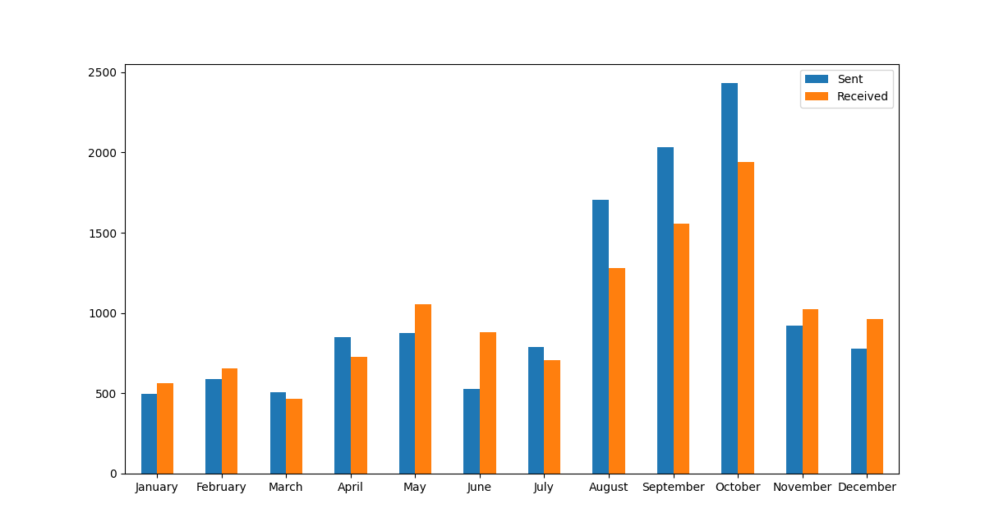
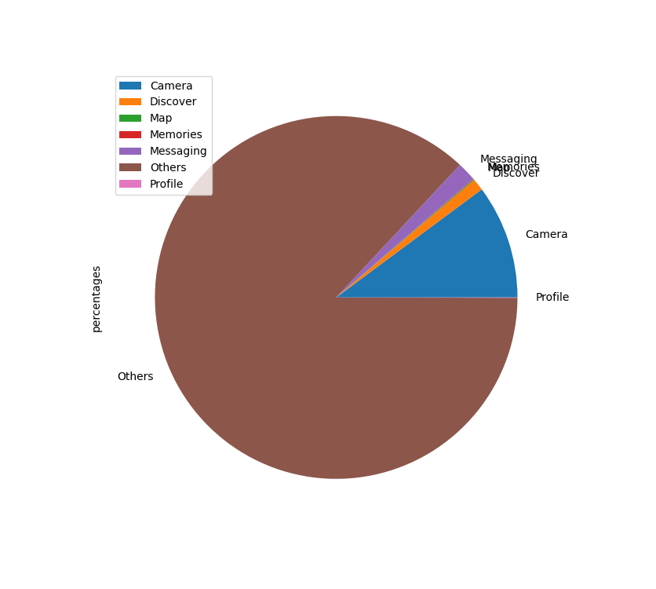

# Snapchat-Data-Analyzer

This program analyzes your Snapchat Data and provides statistics/visuals for them using the Pandas Library and Matplot Library.

## Installation

Use the package manager [pip](https://pip.pypa.io/en/stable/) to install Pandas and Matplot.

```bash
pip install pandas
pip install matplotlib
```
Then, download your private Snapchat data from within the app. Extract the zip folder that was emailed to the address linked to your Snapchat account. Unzip the folder and copy the directory where the data folder is located. 

After running the program, you will need to paste the data folder location into the terminal when prompted.


## Features

A menu will provide several options from which to choose a statistic category you would like to see.

```bash
[1] View Snapchat friend statistics
[2] View chat message statistics
[3] View story history statistics
[4] View time breakdown of time spent on Snapchat
[0] Exit the Snapchat Analyzer Program
```

### Option 1

Provides the total number of friends on Snapchat, your five most recently added friends, your five oldest friends, and the date range for the data values.

```bash
=======================================================================

 Total Number of Friends:   563 

 Five Most Recent Friends:
            Username    Display Name  Date Added
557     **********       *********  06/04/2022
433  *************         *******  06/04/2022
236   ************  **************  06/04/2022
150    ***********        ********  06/04/2022
449       ********  **************  06/04/2022
 
Five Oldest Friends:
             Username   Display Name  Date Added
403    ************            ***  06/30/2015
247        ********           ****  06/30/2015
149  **************   ************  06/30/2015
160          ******         ******  06/30/2015
349        ********     **********  06/28/2015

 Date Range for Data Values:   06/28/2015  to  06/04/2022

=======================================================================
```

### Option 2

Provides total number of messages sent / received, the top five users you send messages to, the top five users you receieve messages from, your five most favorite words to send, the five most unique favorite words to send (which excludes the 100 most common english words), and a bar chart of the spread of total messages sent each month.

```bash
=======================================================================

 Total Number of Messages Sent:   12497 

 Total Number of Messages Received:   11817 

 Total:   24314

 Top Five Users Messages Sent To: 
              Username  Messages Sent       
99               ???           2414
0                ???           1451
224              ???            902
226              ???            662
35               ???            526
 
Top Five Users Messages Received From:      
              Username  Messages Received   
89               ???               2114     
1                ???               1419     
0                ???                865     
223              ???                809     
18               ???                596     
 
Five Favorite Words to Send: 
      Word  Count
39     i   1631
7     to    935
28   the    929
120  and    714
17     a    712
 
Five Unique Favorite Words to Send (Excludes 100 Most Common English Words):
       Word  Count
63     im    648
295     u    535
24   just    394
105    me    371
28    lol    316

=======================================================================
```



### Option 3

Provides the total number of stories viewed, your five most / least viewed stories, and the date range for the data values.

```bash
=======================================================================

 Total Number of User Stories Viewed:   2151 

 Five Most Viewed User Stories:
             Username  Views
1       ***********    386
46  ***************    161
45     ************    100
41      ***********     84
5           *******     76
 
Five Least Viewed User Stories:
             Username  Views
155        ********      1
158        ********      1
159  **************      1
161    ************      1
195       *********      1

 Date Range for Data Values:   05/25/2022  to  06/21/2022

=======================================================================
```

### Option 4

Provides a breakdown of your time spent on Snapchat in percentages and a pop up pie chart.

```bash
=======================================================================

 Breakdown of Time Spent on App: 
   Camera: 10.16%
   Discover: 1.06%
   Map: 0.08%
   Memories: 0.05%
   Messaging: 1.69%
   Others: 86.93%
   Profile: 0.03%

=======================================================================
```



### Option 0

Provides an exit for the program.